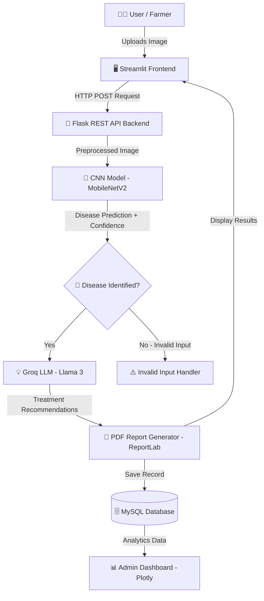

<div align="center">


# 🌿 CinnamonGuard AI
### *Intelligent Disease Detection & Recommendation System for Cinnamon Cultivation*

[](https://python.org)
[](https://tensorflow.org)
[](https://flask.palletsprojects.com)
[](https://streamlit.io)
[](https://mysql.com)
[](LICENSE)

<br/>

> 🇱🇰 *Safeguarding one of Sri Lanka's most treasured exports — one leaf at a time.*

<br/>


</div>

---

## 📖 Table of Contents

- [🌍 About The Project](#-about-the-project)
- [🦠 Detectable Diseases](#-detectable-diseases)
- [✨ Key Features](#-key-features)
- [🏗️ System Architecture](#-system-architecture)
- [🛠️ Tech Stack](#-tech-stack)
- [⚙️ Installation Guide](#-installation-guide)
- [🎬 Demo & Project Resources](#-demo--project-resources)
- [📈 Results & Performance](#-results--performance)
- [🔒 Security Features](#-security-features)
- [🌍 Future Roadmap](#-future-roadmap)
- [👨‍💻 Author](#-author)
- [📜 License](#-license)

---

## 🌍 About The Project

<div align="center">
<table>
<tr>
<td width="60%">

Cinnamon (*Cinnamomum verum*) is one of **Sri Lanka's most valuable agricultural exports**, contributing significantly to the national economy and the livelihoods of thousands of rural farmers.

However, plant diseases such as **Leaf Spot, Leaf Gall, Rough Bark, Stripe Canker**, and **Black Sooty Mold** can devastate crop quality and yield — often going undetected until it's too late.

**CinnamonGuard AI** introduces a cutting-edge solution:

- 📷 Upload an image of a cinnamon leaf or stem
- 🧠 CNN model analyzes and predicts the disease in **real time**
- 💊 Generative AI provides tailored treatment & prevention advice
- 📄 Download a full diagnostic PDF report instantly

> Empowering farmers, agricultural officers, and researchers with **data-driven crop intelligence**.

</td>
<td width="40%" align="center">

```
🌱 Upload Image
      ↓
🔍 CNN Analysis
      ↓
🦠 Disease Identified
      ↓
💡 AI Recommendations
      ↓
📄 PDF Report Generated
      ↓
💾 Stored in Database
```

</td>
</tr>
</table>
</div>

---

## 🦠 Detectable Diseases

<div align="center">

| # | Disease | Affected Part | Severity |
|---|---------|--------------|----------|
| 🟡 | **Leaf Spot** | Leaf | Moderate |
| 🟠 | **Leaf Gall Forming** | Leaf | Moderate–High |
| 🔴 | **Rough Bark** | Stem / Bark | High |
| 🔴 | **Stripe Canker** | Stem / Branch | High |
| ⚫ | **Black Sooty Mold** | Leaf | Moderate |
| 🟢 | **Healthy Plant** | — | None |
| ⚪ | **Others / Invalid Input** | — | — |

</div>

---

## ✨ Key Features

<div align="center">

```
╔══════════════════════════════════════════════════════════════╗
║                    CINNAMONGUARD AI FEATURES                 ║
╠══════════════════════════════════════════════════════════════╣
║  🌱  Leaf & Stem Disease Detection (7 classes)               ║
║  🤖  Real-Time AI Predictions via Deep Learning              ║
║  📊  90%+ Classification Accuracy (MobileNetV2 + CNN)        ║
║  💡  Generative AI Treatment Recommendations (Llama 3)       ║
║  🔐  Secure Registration & Login (bcrypt hashed)             ║
║  📁  Full Detection History Tracking per User                ║
║  📄  Downloadable PDF Diagnostic Reports (ReportLab)         ║
║  📈  Admin Analytics Dashboard (Plotly Charts)               ║
║  📱  Fully Responsive Web-Based Interface                    ║
╚══════════════════════════════════════════════════════════════╝
```

</div>

---

## 🏗️ System Architecture



---

## 🛠️ Tech Stack

<div align="center">

### 🎨 Frontend


### ⚙️ Backend


### 🧠 Artificial Intelligence


### 💬 Generative AI

`Llama 3 (LLM)`

### 🗄️ Database & Reporting


`ReportLab` `bcrypt`

</div>

---

## ⚙️ Installation Guide

### 📋 Prerequisites

Before you begin, make sure you have the following installed on your system:

| Requirement | Version | Download |
|-------------|---------|----------|
| 🐍 Python | 3.10+ | [python.org](https://python.org/downloads) |
| 🐬 MySQL Server | 8.0+ | [mysql.com](https://dev.mysql.com/downloads/mysql) |
| 🔑 Groq API Key | Free | [console.groq.com](https://console.groq.com) |
| 📦 pip | Latest | Included with Python |
| 🗃️ Git | Latest | [git-scm.com](https://git-scm.com) |

> 💡 **Tip:** You can download the full **source code and dataset** directly from the [📁 Google Drive](#-demo--project-resources) below — no cloning needed!

---

### 🚀 Step-by-Step Setup

---

#### **1️⃣ Get the Source Code**

**Option A — Clone from GitHub:**
```bash
git clone https://github.com/RaveenSandeepa-IT/AI-Based-Cinnamon-Disease-Detection-Recommendation-System.git
cd AI-Based-Cinnamon-Disease-Detection-Recommendation-System
```

**Option B — Download from Google Drive:**

> 📥 Download the source code folder directly from the [Project Drive Link](https://drive.google.com/drive/folders/1ObFCDDQGGVX5pc1uC5NbRhs-DUYzusi2?usp=sharing), extract it, and open the folder in your terminal.

---

#### **2️⃣ Create & Activate a Virtual Environment**

```bash
# Create the virtual environment
python -m venv venv
```

```bash
# ✅ Activate on Windows
venv\Scripts\activate

# ✅ Activate on macOS / Linux
source venv/bin/activate
```

> You should see `(venv)` appear at the start of your terminal prompt, confirming the environment is active.

---

#### **3️⃣ Install All Dependencies**

```bash
pip install -r requirements.txt
```

<details>
<summary>📦 <strong>Click to view key dependencies</strong></summary>

```txt
tensorflow>=2.10.0
keras
flask
flask-cors
streamlit
mysql-connector-python
groq
opencv-python
numpy
pandas
plotly
reportlab
bcrypt
pillow
python-dotenv
scikit-learn
```

</details>

> ⚠️ If you encounter issues with TensorFlow, ensure your Python version is **3.10** and run:
> ```bash
> pip install tensorflow==2.13.0
> ```

---

#### **4️⃣ Configure Environment Variables**

Create a `.env` file in the **root directory** of the project:

```bash
# Create .env file (Windows)
copy NUL .env

# Create .env file (macOS / Linux)
touch .env
```

Then open `.env` and add your credentials:

```env
# 🔑 Groq API Configuration
GROQ_API_KEY=your_groq_api_key_here

# 🗄️ MySQL Database Configuration
DB_HOST=localhost
DB_PORT=3306
DB_USER=your_mysql_username
DB_PASSWORD=your_mysql_password
DB_NAME=cinnamon_db

# ⚙️ Flask Configuration
FLASK_ENV=development
FLASK_PORT=5000
```

> 🔑 Get your free Groq API key at [console.groq.com](https://console.groq.com) — it's free to sign up!

---

#### **5️⃣ Set Up the MySQL Database**

Make sure your MySQL server is running, then import the schema:

```bash
# Login to MySQL
mysql -u root -p

# Inside MySQL shell — create the database
CREATE DATABASE cinnamon_db;
EXIT;

# Import the schema
mysql -u root -p cinnamon_db < database/schema.sql
```

> ✅ The database tables (users, detections, reports) will be created automatically.

---

#### **6️⃣ Add the Trained AI Model**

Place your trained CNN model file in the `model/` directory:

```
📁 project-root/
 └── 📁 model/
      └── 🧠 cinnamon_model.h5      ← Place your model here
```

> 📥 The pre-trained model (`cinnamon_model.h5`) is available in the [Google Drive folder](https://drive.google.com/drive/folders/1ObFCDDQGGVX5pc1uC5NbRhs-DUYzusi2?usp=sharing).

---

#### **7️⃣ Start the Flask Backend API**

Open a terminal and run:

```bash
python api.py
```

You should see:
```
 * Running on http://127.0.0.1:5000
 * Debug mode: ON
```

> 🔗 The REST API is now live at: `http://localhost:5000`

---

#### **8️⃣ Launch the Streamlit Frontend**

Open a **second terminal** (keep the Flask one running), activate the venv again, then run:

```bash
streamlit run streamlit_app.py
```

Your browser will automatically open:

> 🌐 App is live at: `http://localhost:8501`

---

### ✅ Verify Everything is Working

| Service | URL | Expected |
|---------|-----|----------|
| 🔌 Flask API | `http://localhost:5000` | `{"status": "running"}` |
| 🌐 Streamlit App | `http://localhost:8501` | Login / Register Page |
| 🗄️ MySQL | localhost:3306 | `cinnamon_db` database exists |

---

### 🛠️ Troubleshooting

<details>
<summary>❌ <strong>ModuleNotFoundError</strong></summary>

Make sure your virtual environment is activated and all packages are installed:
```bash
source venv/bin/activate   # or venv\Scripts\activate on Windows
pip install -r requirements.txt
```
</details>

<details>
<summary>❌ <strong>MySQL Connection Error</strong></summary>

- Confirm MySQL server is running
- Double-check credentials in your `.env` file
- Ensure the `cinnamon_db` database exists:
```sql
SHOW DATABASES;
```
</details>

<details>
<summary>❌ <strong>Groq API Error / Invalid Key</strong></summary>

- Visit [console.groq.com](https://console.groq.com) and regenerate your API key
- Ensure there are no spaces or quotes around the key in `.env`
</details>

<details>
<summary>❌ <strong>Model File Not Found</strong></summary>

- Download `cinnamon_model.h5` from the [Google Drive](https://drive.google.com/drive/folders/1ObFCDDQGGVX5pc1uC5NbRhs-DUYzusi2?usp=sharing)
- Place it inside the `model/` directory
</details>

---

## 🎬 Demo & Project Resources

<div align="center">

> 🎥 **Want to see the system in action before setting it up?**
> A full walkthrough video of the project is available for you to preview!

---

### 📁 Google Drive — Project Resources

[](https://drive.google.com/drive/folders/1ObFCDDQGGVX5pc1uC5NbRhs-DUYzusi2?usp=sharing)

</div>

The Drive folder contains everything you need to explore and run this project:

| 📦 Resource | 📄 File / Folder | Description |
|------------|-----------------|-------------|
| 🎬 **Demo Video** | `project recording.rar` | Full recorded walkthrough of the system |
| 💻 **Source Code** | Source Code folder | Complete project source code |
| 🗃️ **Dataset** | Dataset folder | Cinnamon disease image dataset used for training |
| 🧠 **Trained Model** | `cinnamon_model.h5` | Pre-trained MobileNetV2 CNN model |

---

<div align="center">

```
📥  Step 1: Open the Google Drive link above
📂  Step 2: Download "project recording.rar" to watch the demo
💻  Step 3: Download source code & dataset to run locally
🧠  Step 4: Place the model file in the /model directory
🚀  Step 5: Follow the Installation Guide above & launch!
```

> 💡 *Watching the demo video first is highly recommended — it shows the complete user flow from image upload to PDF report generation.*

</div>

---

## 📈 Results & Performance

<div align="center">

| Metric | Result |
|--------|--------|
| 🎯 **Classification Accuracy** | **90%+** |
| ⚡ **Prediction Speed** | Real-time (seconds) |
| 🏷️ **Total Disease Classes** | 7 (including Healthy & Invalid) |
| 📉 **Manual Inspection Dependency** | Significantly Reduced |
| 🧑‍🌾 **Target Beneficiaries** | Farmers, Agri Officers, Researchers |

</div>

> **Model:** MobileNetV2 fine-tuned CNN — optimized for mobile-class efficiency with high accuracy on agricultural image datasets.

---

## 🔒 Security Features

```
🔐  Password Hashing          →  bcrypt (industry-standard salted hashing)
👥  Role-Based Access Control →  Farmer | Agricultural Officer | Admin
🛡️  Secure Login Sessions     →  Flask session management
🔏  Protected Admin Dashboard →  Access restricted to admin roles only
```

---

## 🌍 Future Roadmap

- [ ] 📱 **Mobile App Version** — React Native / Flutter
- [ ] 🌐 **Offline Prediction Support** — TensorFlow Lite on-device inference
- [ ] 🗣️ **Multi-language Support** — Sinhala 🇱🇰 / Tamil / English
- [ ] 📡 **IoT Sensor Integration** — Real-time field monitoring
- [ ] 🌱 **Crop Expansion** — Tea, Pepper, Rubber disease detection
- [ ] 🛰️ **Drone Image Analysis** — Aerial crop health monitoring

---

## 👨‍💻 Author

<div align="center">


### **Raveen Sandeepa Pathirana**
*Data Science Undergraduate | AI & Machine Learning Enthusiast*

[](https://github.com/RaveenSandeepa)
[](https://linkedin.com/in/raveen-sandeepa)

</div>

---

## 📜 License

```
MIT License

Copyright (c) 2024 Raveen Sandeepa Pathirana

Permission is hereby granted, free of charge, to any person obtaining a copy
of this software and associated documentation files (the "Software"), to deal
in the Software without restriction.
```

See the [LICENSE](LICENSE) file for full details.

---

<div align="center">


### 🌿 *Protecting Sri Lanka's Green Gold — Powered by AI*

**If this project helped you, please consider giving it a ⭐ on GitHub!**

[](https://github.com/RaveenSandeepa-IT/AI-Based-Cinnamon-Disease-Detection-Recommendation-System)

---

*Made with ❤️ in Sri Lanka 🇱🇰*

</div>
